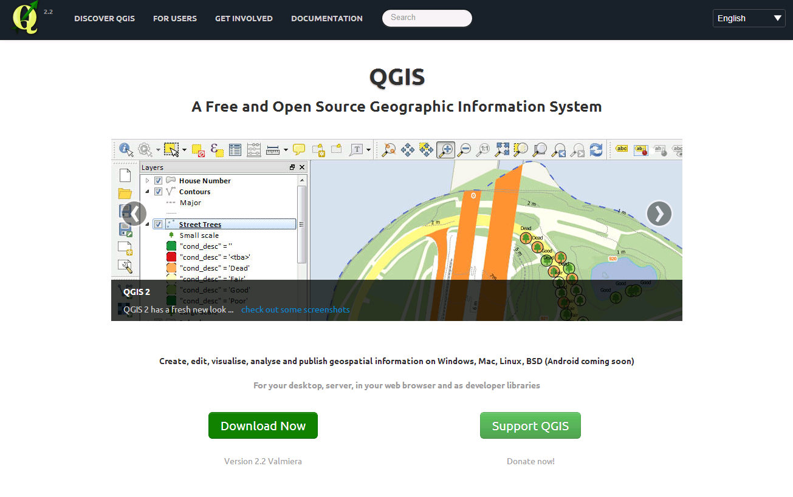
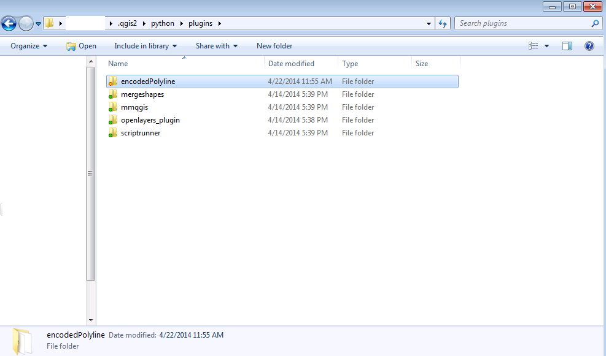
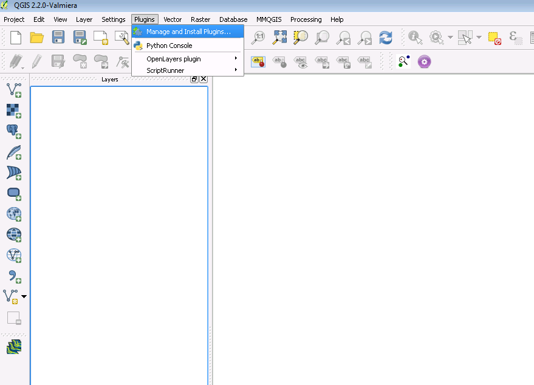
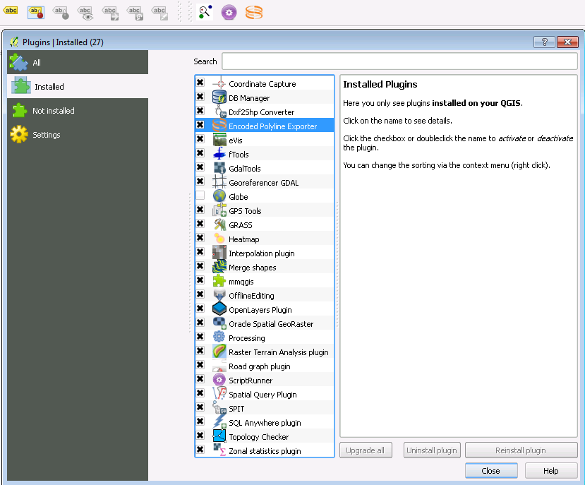
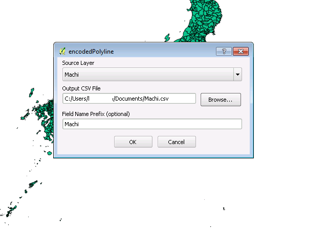
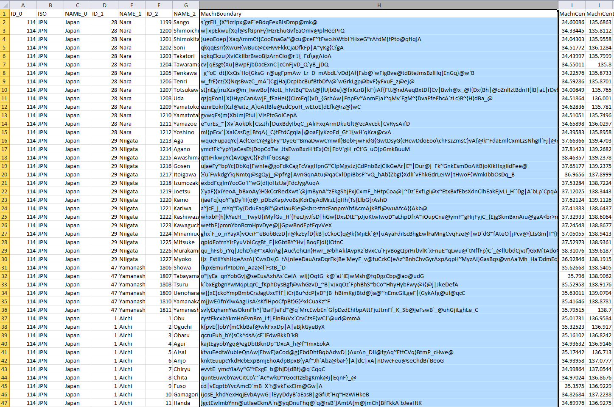

# Encoded Polyline - Plugin for QGIS
 
Encoded polylines are essentially boundary lines in a space-saving and efficient format.
 
They are used in many applications, from GIS tools to BI applications and more.
 
The **Encoded Polyline** plugin for QGIS allows you to export encoded polyines in a friendly CSV format for use in your applications.

___

## Installation

### Manual
1. Install QGIS from [QGIS.org](http://www.qgis.org)
 

2. Download the Encoded Polyline source files from [Github](http://www.github.com/) (Click the Download ZIP button in the lower right)
3. Extract the downloaded ZIP file
4. Cut or Copy the **encodedPolyline** folder from inside the **dist** folder
5. Paste or Move the **encodedPolyline** folder into your Plugin folder:
    + Windows - `%USERPROFILE%\.qgis2\python\plugins`
    + OSX/Unix - `~/.qgis2/python/plugins`
  
6. Load QGIS and go to Plugins -> Manage and Install Plugins
> 
7. Under the Installed tab, check the box next to the **Encoded Polyline Exporter** plugin (an icon should appear on your toolbar)
> 
8. You're good to use the plugin!

### Automatic
+ Coming soon!

___

## Usage

1. Load up a SHP or any file with boundary demarcations
2. Click the **Encoded Polyline** icon
> 
3. Choose a Destination and column Prefix, then click OK
4. Open the created CSV in your spreadsheet application
> 
5. Use your data wherever you need it!

___

## Information about Encoded Polylines

+ [Google Developers Explanation](https://developers.google.com/maps/documentation/utilities/polylinealgorithm)
+ [Less Technical Explanation](http://www.danmandle.com/blog/what-is-an-encoded-polyline/)

___

## Created By
+ [Patrick Vinton](http://www.github.com/pvinton) at [Analytics8](http://www.analytics8.com)

## Maintained By
+ [Takeshi Takahashi](http://www.github.com/therealtakeshi) at [Analytics8](http://www.analytics8.com)

<!--
QGIS-Plugins
============

Plugin installation directions:

1) Copy everything in the "dist" folder to your QGIS plugin directory.  On my machine, my plugin directory is:
      C:\Users\pvinton\.qgis2\python\plugins

   The end result should look something like this:
     C:\Users\pvinton\.qgis2\python\plugins\encodedPolyline

2) The next time you start QGIS, go to  Plugins -> Manage and Install Plugins

3) In the “Installed” section, check the box next to “Encoded Polyline Exporter”

4) Once checked, you should see an Analytics8 logo on your toobar.  If you don’t, right-click on your toolbar and make sure “Plugins” is checked.
-->